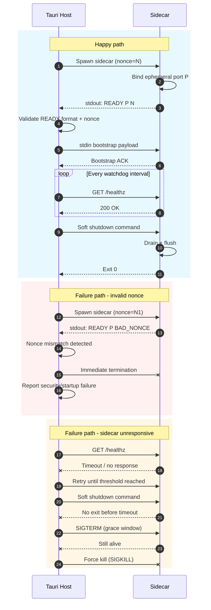

# Process Lifecycle

## Startup Protocol

1. **Tauri spawns sidecar**
   - The desktop host launches the sidecar process with stdio pipes enabled.
   - Tauri records the sidecar PID and generates a one-time bootstrap nonce.
2. **Sidecar binds ephemeral port**
   - The sidecar initializes internal services, then binds an available loopback port (`127.0.0.1:0` pattern).
   - After binding, it resolves the actual assigned port.
3. **Sidecar emits `READY <port> <nonce>` on stdout**
   - Once fully initialized, the sidecar writes a single readiness line to stdout in this exact format:
     - `READY <port> <nonce>`
   - `<nonce>` must exactly match the nonce passed by Tauri at launch time.
4. **Tauri validates nonce and sends bootstrap payload via stdin**
   - Tauri parses stdout, verifies line format, numeric port range, and nonce equality.
   - If validation passes, Tauri sends a bootstrap payload (configuration, auth context, feature flags, etc.) over stdin.
   - Sidecar acknowledges bootstrap and transitions to serving requests.

### Startup validation and failure handling

- If the `READY` line is malformed, the port is invalid, or nonce validation fails, Tauri must treat startup as compromised.
- On invalid nonce, Tauri immediately terminates the sidecar, emits a security error, and retries with a fresh nonce only if policy permits.
- If no valid `READY` message arrives within the startup deadline, Tauri kills the sidecar and reports startup timeout.

## Health Protocol

### Heartbeat endpoint

- Sidecar exposes a lightweight heartbeat endpoint, e.g. `GET /healthz`.
- Expected response:
  - HTTP `200 OK`
  - Body payload with minimal status (e.g. `{"status":"ok","uptimeMs":...}`)
- Tauri polls this endpoint on a fixed cadence.

### Watchdog interval

- Use a watchdog loop with:
  - **poll interval**: short period (for example 2-5 seconds)
  - **failure threshold**: consecutive failed heartbeats before declaring unhealthy (for example 3 failures)
- Failed heartbeat conditions include timeout, connection refusal, non-200 response, or invalid payload.
- On threshold breach, Tauri initiates graceful shutdown and restart strategy.

### Parent PID checks

- Sidecar periodically verifies parent process liveness (parent PID check).
- If parent PID is missing/re-parented unexpectedly, sidecar assumes host is gone and self-terminates.
- This avoids orphaned sidecars when Tauri crashes or is force-closed.

## Graceful Shutdown and Escalation

### Soft stop sequence

1. Tauri sends a shutdown command over stdin (or control endpoint) with reason code.
2. Sidecar stops accepting new work.
3. Sidecar drains in-flight requests and flushes state/log buffers.
4. Sidecar exits with success code and closes stdio.

### Timeout and forced termination path

- Tauri starts a shutdown timer when soft stop is initiated.
- If sidecar has not exited before timeout:
  1. Tauri sends a stronger terminate signal (platform-appropriate, e.g. SIGTERM).
  2. Waits a short grace period.
  3. If still alive, Tauri force-kills process (e.g. SIGKILL / TerminateProcess).
- Tauri logs which escalation stage was required for observability.

## Sequence Diagram

